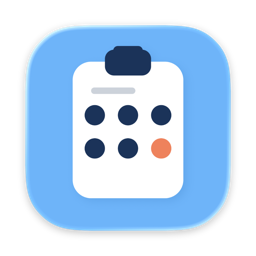

 <div align="center">



# Otifier

**Auto-copy verification codes from macOS notifications to your clipboard.**

[](LICENSE)

[](https://github.com/immanuel/otifier/releases)

</div>

Stop squinting at your phone to type the six-digit code your bank just texted
you. Otifier lives in your menu bar, watches macOS notification banners as
they appear, and copies any verification code straight to your clipboard —
ready to paste.

It works with anything that surfaces as a macOS banner: mirrored iPhone SMS,
email previews, app push notifications, etc.

## Demo

<!-- [PLACEHOLDER: record a short GIF (notification arrives → code auto-copied → pasted into a login form) and save as docs/demo.gif] -->
<!--  -->

## Features

- **Just works** — no setup beyond granting Accessibility permission once
- **Universal** — any macOS notification banner, including mirrored iPhone texts
- **Instant** — code lands on your clipboard the moment the banner appears
- **History** — recent codes in the menu bar; click any one to re-copy
- **100% local** — no network calls, no telemetry, codes never leave your Mac

## Install

**Download the latest DMG**, drag `Otifier` to Applications, launch, and
grant Accessibility permission when prompted.

> Download: [latest release](https://github.com/immanuel/otifier/releases/latest)

To launch on login, add `Otifier` to **Login Items** in System Settings —
or use the toggle in Otifier's menu.

<details>
<summary>Or build from source</summary>

Requires macOS 13+ on Apple Silicon and Xcode Command Line Tools
(`xcode-select --install`). 

```bash
make app
open .build/Otifier.app
```

</details>

## How it works

```
iPhone notification → mirrored to Mac → notification banner
    → AX tree poll (1.5s) → verification code match → clipboard
```

Otifier polls the Notification Center's Accessibility tree every 1.5 seconds.
When a banner contains a verification code, it copies the code and shows a
small confirmation notification.

<details>
<summary>Detection rules</summary>

OTPs are matched via regex with keyword gating to avoid false positives:

- **Patterns**: `code: 123456`, `OTP: 1234`, `G-583920`, bare 4–8 digit codes
- **Keywords**: verification, code, OTP, one-time, 2FA, sign in, 验证码, …
- **Filtering**: rejects repeated digits (`1111`), order/tracking numbers,
  codes shorter than 4 digits

</details>

## Privacy

Otifier reads notification banners locally via the Accessibility API and
writes to your clipboard. That's it.

- No analytics, no telemetry, no crash reporting
- No network calls except for checking app updates at `otifier.com`
- Verification codes are never sent anywhere

## Contributing

Issues and pull requests are welcome.

```bash
make test          # run the test suite
make otifier       # build a CLI version (prints detected codes to stdout)
make ax-explorer   # diagnostic tool to dump the AX tree of notification banners
```

The CLI and AX explorer are handy when debugging why a particular notification
isn't being captured — run `ax-explorer --watch 30` while a banner is on
screen to inspect its Accessibility structure.

## License

[MIT](LICENSE).

## Acknowledgements

Otifier embeds [Sparkle](https://sparkle-project.org) for in-app updates,
© Andy Matuschak and the Sparkle Project, distributed under the
[MIT License](https://github.com/sparkle-project/Sparkle/blob/2.x/LICENSE).
